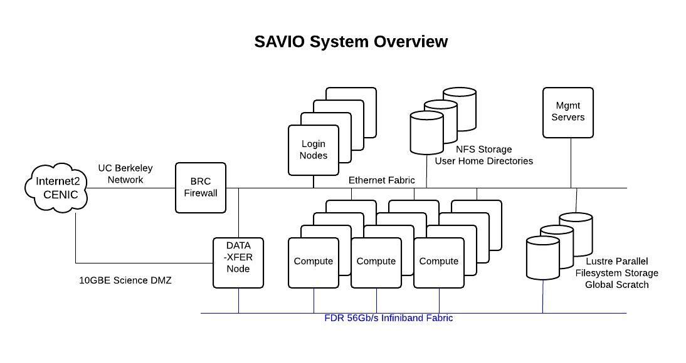

Update 12/2/2022: the master branch of the Haeffnerlab/bem repository now has savio server support, the savio documentation included in this repository, and interactive 3-d tools for meshing and potential analysis. For now we (Ben, Shuqi, Qian, Nicole) plan to make that the development repository for bem simulations. For questions, comments, concerns please contact Ben. 

# BEM Simulations for QuantNET

For my simulations of the QuantNET trap, I created a fork of [haeffnerlab/bem](https://github.com/haeffnerlab/bem) called BEM-Savio. This is intended to be a leaner and better documented version of the BEM with further support for running BEM on Berkeley's high performance computing cluster (BRC-HPC) called Savio. 

*Updated: Sept. 2022 YJZ*

## Table of contents
- [What is BRC-HPC Savio?](#id-1)
- [Savio Basics](#id-2)
- [bem-savio Workflow Overview](#id-3)
- [0. Installing bem-savio](#id-4)
- [1. Creating the Fusion360 Model](#id-5)
- [2. Configuring a new Job in bem-savio](#id-6)
- [3. BEM Electrostatics](#id-7)
- [4. Multipoles, Analysis, and Control](#id-8)
- [TODOs](#id-9)

## What is BRC-HPC Savio?<div id='id-1'/>

BRC-HPC is a high-performance computing cluster run by Berkeley Research Computing (BRC). The cluster consists broadly of login nodes and compute partitions. Data and software are stored in the cluster within your personal directory or a *shared group directory*. All nodes (login and compute) have access to these directories.



SSH-ing into the cluster is handled by the 4 login nodes (a random node is assigned). You may test commands and scripts within the login in node, but the login nodes are a shared resource and not meant to handle large computational tasks.

To schedule computational tasks (i.e. BEM simulations) to be run on a computing cluster, Savio uses slurm, a job scheduler. This is described in the sections below.

## Savio Basics <div id='id-2'/>

The full user-guide for Savio may be found [here](https://docs-research-it.berkeley.edu/services/high-performance-computing/user-guide/).

Note: if this is the first time you are reading this documentation, I suggest skipping the remainder of this section and returning when you are ready to run BEM on savio and wish to learn the specifics.

### Service Units

Our lab is granted 300,000 yearly service units via Hartmut's faculty allowance. To check that you have access to this computing allowance, login to [MyBRC](https://mybrc.brc.berkeley.edu/user/login) and check that the BRC Cluster Project ```fc_haeffnerbem``` appears on your dashboard. To be added to the project, please contact Hartmut or Yi.

Note: service units are calculated based on the number of cores in the node you requested. E.g., if you run a program for 1 hr on a single core of a 16-core node, you will be charged 16 service units. Therefore, it is in your interest to use as many cores as possible (i.e. as many cores as the available memory allows).

### SSH

To ssh into the a login node, 

```ssh your_BRC_username@hpc.brc.berkeley.edu```

*The password is not your BRC pin*. One-time password authentication via your phone is required. If you have not already, set up OTP via Google Authenticator by following these [directions](https://docs-research-it.berkeley.edu/services/high-performance-computing/user-guide/setting-otp/). The password you must enter is ```XY``` where ```X``` is your BRC pin and immediately following with no spaces is ```Y``` the 6-digit one-time code from Authenticator. 

### Access to the Group Computing Allowance

The hardware configurations for each of the Savio partitions may be found [here](https://docs-research-it.berkeley.edu/services/high-performance-computing/user-guide/hardware-config/#Savio-Hardware). To find which accounts and partitions you have access to,

```sacctmgr -p show associations user=$USER```


Since our simulations are generally limited by memory, we generally would like to choose bigmem nodes.

### Modules and Custom Software

A number of modules are installed in Savio. These modules can be loaded with the `module` command. For example, every time we run BEM, we want to first load Python (you can run Python without loading the Python module, but it is an outdated version).

`module load python`

**Note: this is a commonly forgotten step**

We will install our own software in a conda environment in the shared directory `/global/home/groups/fc_haeffnerbem`. All users with access to our project has access to this shared directory. (Note: this might cause issues is multiple people want to run BEM at the same time. This can be resolved by installing and running BEM from each individual's personal directory.)

A final quirk in using conda environments on Savio *not* using the normal `conda activate module_name` but rather,

`source activate module_name`

**This is also common source of error.**


### Scheduling and Monitoring Jobs with slurm

TODO TALK ABOUT SLURM SBATCH

The ```sq``` module shows recent and pending jobs,

```
module load sq
sq
```


Note: the directory where you run the ```sbatch``` command is the directory where you batch script runs.

Note: you have to deactivate the enviornment before running the sbatch command

### Transferring Data

TODO

## Workflow Overview <div id='id-3'/>

Each time you run a BEM analysis, the workflow will consist broadly of four distinct tasks:

1. Creating the Fusion360 model
	- Creating a model of the trap in Fusion360
	- Coloring the trap electrodes in Fusion360
	- Exporting the model as an STL
2. Configuring a new job in bem-savio
	- Importing the STL model into bem-savio and re-meshing via bem-savio
	- Configuring simulation parameters in bem-savio
3. BEM electrostatics
	- Running the BEM electrostatics simulation to determine the potentials generated by each electrode.
	- The BEM electrostatics can either be run locally (i.e. on your computer) or on a Savio compute node (e.g. savio-bigmem with 20 cores and 500 Gb memeory). 
4. Multipoles and analysis
	- Visualizing the potentials generated by each electrode. For example, using the RF Psuedopotential to determine the location of the RF null.
	- Calculating the multiples of the potentials generated by each electrode.
	- Calculating the voltages that should be applied to each electrode in order to generate the desired trapping/control multipoles.
	
## 0. Installing bem-savio <div id='id-4'/>

### Installing BEM Locally

Note: as of writing, the current version of bem and bem-savio should run without error on Windows---though it has not been tested extensively. I recommend using Linux or a Unix-based system.

To install BEM on your computer, clone the [bem-savio](https://github.com/HaeffnerLab/bem-savio) directory and create a new conda environment. 

```conda create -n bem39 python=3.9  ```

Activate the environment. You should see the command prompt change to reflect this (e.g. from base to bem39)

```conda activate bem39```

Navigate to the bem-savio directory which contains ```setup.py``` and install BEM


```pip install .```

To deactivate the environment,

```conda deactivate ``` 

### Installing BEM on Savio


The ```bem39``` conda environment and the bem-savio repository should already be be installed in the shared group directory ```/global/home/groups/fc_haeffnerbem/bem39```. To check, navigate to the group directory and run,

```
module load python
conda env list
```

If BEM is already installed in the group directory, skip this section. If bem-savio is not installed, navigate to the group directory, clone the [bem-savio](https://github.com/HaeffnerLab/bem-savio) directory and create a new conda environment. 

```
cd /global/home/groups/fc_haeffnerbem
conda create -p bem39 python=3.9  
```

Activate the environment. You should see the command prompt change to reflect this (e.g. from base to bem39)

```source activate /global/home/groups/fc_haeffnerbem/bem39```

Navigate to the bem-savio directory which contains ```setup.py``` and install BEM


```pip install .```

To deactivate the environment,

```source deactivate ``` 

## 1. Creating the Fusion360 Model <div id='id-5'/>

### Coordinates

First, create a model of the trap in Fusion360. Check that your model follows optical coordinates (see figure below). In other words, the trap axis in Fusion360 should be along the z-axis and the vertical direction should be along the y-axis.


<center><figcaption>There are two standard conventions for coordinates. In CAD coordinates, x is along the trap axis and in optical coordinates z is along the trap axis. **Throughout BEM, we will always used optical coordinates.**</figcaption></center>

Additionally, ensure that your trap model is a single body in Fusion360. When exporting, each body becomes its own STL and we wish to have the trap as a single STL.

### Coloring Electrodes

In the Fusion360 design, the trap is a single body. Therefore, we must be able to distinguish electrode surfaces from one another somehow. This is accomplished by coloring the face of each electrode. Later in bem-savio, we will identify the electrodes with a mapping between the color used in Fusion360 and the electrode name.

To facilitate this process, a set of predefined colors for BEM have been created. To import these colors into Fusion360:

1. In the Modify tab, click on Manage Materials to launch the Material Browser
2. In the Materials Browser, select Appearence on the top bar
3. In the bottom bar of the Material Browser, click on the folder icon, select Open Existing Library and load the BEM color library located ```RUN/helper_functions/bemColors_lib/bemColors.adsklib```
4. Now, you should see a bemCol folder appear in the left menu. For *each* color, right click and select Add To/Faviorites


Now color each electrode:

1. Select the face you wish to color
2. Open the Appearance tab (press 'a')
3. Using the search bar, find the appropriate BEM color you wish to use (```bemxx```) and drag that color over the face you wish to color.


<center><figcaption>Sample colored model. Notice bem1 is the top left electrode.</figcaption></center>


Note: make sure to color all surfaces that you wish to be included in the simulation. All surfaces that are not colored (and subsequently renamed in bem-savio) will be discarded by bem-savio.

Note: why are we specifically using these colors? STL files do not support colors. A (not-so-standardly) accepted workaround is to use the Attribute data of each triangle face to store color information. However, the Attribute is only 2 bytes long while a RGB color is 3 bytes long. Therefore, in general, the original colors will be modified when being saved to a STL. ```bemCol``` handles these color issues by defining a between the ```bemxx``` colors imported into Fusion360 and the colors bem-savio reads when importing the trap STL.  

### Exporting to STL

Finally, export your model as an STL. In Fusion360, select the trap body using the menu on the left-hand side and select Save as Mesh. Make sure to select the following options:

- Format: binary STL
- Units: mm

Optionally, you can refine the mesh density when exporting in Fusion360. However, we will be re-meshing in later steps, so this is not strictly necessary.

## 2. Configuring a new Job in bem-savio <div id='id-6'/>

### A New Job

In bem-savio, ```RUN/run.py``` is a provided script that handles initializing and running the simulation. *You will not need to edit* ```RUN/run.py```. Instead, for each new job (i.e. new trap) create a new directory in the jobs folder (e.g. ```RUN/jobs/your-job-name```) and place within the directory the STL model and a configuration file which informs ```RUN/run.py``` of the specific parameters of your simulation.

Navigate to ```RUN``` and create a new directory for your job in ```RUN/jobs```,

```
mkdir jobs/your-job-name
cd jobs/your-job-name
```

Place your STL in this new directory (i.e. ```RUN/jobs/your-job-name```) and create a configuration file,

```touch JOB_CONFIG.py```

Your directory tree should now look like this, 

```
\RUN
	run.py
	\jobs
		\example
			pyramidtrap.stl
			JOB_CONFIG.py
		\your-job-name
			your-model.stl
			JOB_CONFIG.py
	helper_functions
	saviojob.sh
```

In the sections below, we will explain how to fill out ```JOB_CONFIG.py``` using the ```RUN/jobs/examples``` job as an example. It is important to populate the configuration file in the order of the sections below. 

### JOB_CONFIG: Importing STL

First, populate ```JOB_CONFIG.py``` with,

```python
from bem import *
import numpy as np

# name of the stl file
STL_file = 'your-model.stl'
# units of the mesh (e.g. 1e-3 for mm)
mesh_units = 1e-3

# plotting settings
plot_three_d = False
show_plots = True
save_plots = True
save_plots_dpi = 1000
```

- ```STL_file```: the name of the STL model located in your job directory. For example, ```STL_file = 'pyramidtrap.stl'```.
- ```mesh_units``` are the units in which the STL file were exported. This should always be mm.
- `show_plots`, `save_plots`, and `save_plots_dpi`: toggles whether plots of the mesh before and after re-meshing should be shown/saved. The default behavior is a 2D of the mesh projected to the z-x plane (i.e. top-down view). Optionally, `plot_three_d` toggles if the mesh should be plot in a 3D view.


<center><figcaption>Sample plots of the mesh, 2D and 3D.</figcaption></center>


### JOB_CONFIG: Naming Electrodes

Next, we name each electrode using the BEM colors described above. ```electrode_colors``` is a set tuples describing this mapping `('bemxx', electrode_name)`. The electrode names should be of the form `'DC* | RF* | GND'`. 

```
# naming electrodes
electrode_colors = {
    ('bem1', 'DC1'),
    ('bem2', 'DC2'),
    ('bem3', 'DC3'),
    ('bem4', 'DC4'),
    ('bem5', 'DC5'),
    ...
    ('bem21', 'DC21'),
    ('bem22', 'RF'),
    ('bem23', 'GND'),
}
```

### JOB_CONFIG: Specifying the Grid

The grid describes to bem-savio the set of points at which it should evaluate the potential generated by each electrode. Therefore, a finer the grid yields greater resolution for our potential.


<center><figcaption>A mockup of what a grid might look like. Note: in practice, the grid the you use should probably be finer and over a smaller area. However, this is easier to illustrate.</figcaption></center>

In order to configure the grid, we must specify,

- `x0,y0,z0` which is the location of the center (or origin) of our grid. The value of this point should be your best guess for the location of RF null.
- `Lx,Ly,Lz` is the size of each dimension of the grid. For example, if `Lx=0.100`, then the grid extends 50 microns to the left and 50 microns to right of the origin along the x-axis.

```
# specify grid origin
x0 = 0*1e-3
y0 = 2 + 75*1e-3
z0 = 0*1e-3

# specify grid points
Lx, Ly, Lz = 0.100, 0.200, 0.500
s = 0.0025
sx, sy, sz = s, s, s
```

In the example above, we define the origin as at the center of the zx-plane and at a height of y=2000+75 microns because the raise trap surface is 2 mm tall and we expect our trapping height to be 75 microns. Furthermore, we define the set of grid points over a volume of 100 x 200 x 500 microns with points every 2.5 microns in all directions (recall ```mesh_units=1e-3```).

### Compile Test!

If you've followed all the steps above, `JOB_CONFIG.py` now contains enough information to perform a basic test of: importing the STL, identifying the electrodes, and constructing the grid.

Navigate to the `RUN` folder. Activate the conda environment (`conda activate bem39`) if you have not already and execute,

```
python run.py [your-job-name]
```

`run.py` should run without error. If `show_plots` is toggled on, you should see a plot of trap mesh.

### JOB_CONFIG: Re-meshing

We use `mesh.triangulate` and `mesh.areas_from_constraints` to re-mesh. In `JOB_CONFIG.py`, define a new function `remesh`, and place all re-meshing code (e.g. calls to `mesh.triangulate`) within this function.

```
def remesh(mesh):
	# TODO
```

There are three main re-meshing operations (note: the documentation for triangulate may be found [here](doc/Triangle_ Command line switches.pdf) and contains less-common options):

**<u>1. Improving triangle quality</u>**: the quality of a triangle is defined by the minimum angle of all triangles. 

<center><figcaption>Bad and better quality triangles.</figcaption></center>

To increase the quality (minimum angle) run,

`mesh.triangulate(opts='q30Q')`

where `q` is the quality flag, `30` specifies the minimum angle, and `Q` specifies that the triangulation should run quietly (little output). You may change `30` to any minimum angle desired. Note that (from the documentation): if the minimum angle is 20.7 deg or smaller, the triangulation algorithm is theoretically guaranteed to terminate;
in practice, the algorithm often succeeds for minimum angles up to 33 deg; it usually doesn't terminate for angles above 34 deg. If the angle you specify is too large, the triangulation will not terminate.

**<u>2. Increasing density</u>**: to increase the density of triangles, there is an option to specify the maximum triangle area. With this option, `mesh.triangulate` will add triangles until all triangles have an area smaller than the maximum area.

`mesh.triangulate(opts='a0.1Q')`

where `a` is the maximum area flag, `0.1` specifies the maximum area, and `Q` specifies that triangulate should run quietly.

<center><figcaption>Increasing the triangle density with the `a` flag.</figcaption></center>

**<u>3. Increasing density with areas from constraints</u>**: we often wish to increase the density of an area of interest while but not the density globally. This way, we obtain greater charge resolution near the region of interest while sacrificing the resolution of charges far away in favor of a faster runtime.

In BEM, first call the function `mesh.areas_from_constraints` which internally sets the maximum area parameter (described previously) based on some constraint,

`mesh.areas_from_constraints(constraint)`

where `constraint` defines the geometry of our region on interest. There are two types of constraint objects. First is the sphere,

`Sphere(center=np.array(x0,y0,z0), radius=rad, inside=in_density, out=out_density)`

where `center` is the center of the sphere, `radius` is the radius of the sphere, `in_area` is the maximum area of triangles inside the constraint, and `out_area` is the maximum area of triangles outside the constraint (generally `in_area`<`out_area`).

Second is the cylinder,

`Cylinder(start=np.array(x0,y0,z0-2.5), end=np.array(x0,y0,z0+2.5), radius=rad, inside=in_density, out=out_density)`

where `start` and `end` are two points that (when connected in a line) form the axis of the cylinder, and `rad` is the radius of the cylinder.

After defining the areas from constraints, we must call triangulate to actually tell mesh to re-mesh based on the areas we have defined: `mesh.triangulate(opts='Q',new=False)`. An example of this entire process:

```
in_area = 1e-4
out_area = 0.1
rad = 5*75e-3 # five times the hypothesized ion height

mesh.areas_from_constraints(Sphere(center=np.array([x0,y0,z0]),radius=rad,inside=in_area,outside=out_area))
mesh.triangulate(opts='Q',new=False)
```

<center><figcaption>Example of a spherical and cylindrical constraint. Note that the shape of the region of interest do not look very clean. This is because `mesh.areas_from_constraints` only increases the density of a region if all vertices of the existing triangle fall within the constraint. Therefore, a coarse initial mesh will lead to **aliasing**. The solution is to slightly increase the density of the global mesh before defining areas from constraints.</figcaption></center>

**Full Example**: it is encouraged to increase the density piece by piece to obtain the best quality mesh. The following is a full example of the `remesh` function,

```
def remesh(mesh):
	# global
	mesh.triangulate(opts="q30Q",new = False)
	mesh.triangulate(opts='1Q', new=False)
	
	# first refinement
	# believe ion height is approx. 75 micron
	inside=1e-1
	outside=1
	rad = 5*75e-3
	mesh.areas_from_constraints(Sphere(center=np.array([x0,y0,z0]),radius=rad, inside=inside, outside=outside))
	mesh.triangulate(opts="Q",new = False)
	
	# second refinement
	inside=1e-3
	outside=1e-1
	rad = 2*75e-3
	mesh.areas_from_constraints(Sphere(center=np.array([x0,y0,z0]),radius=rad, inside=inside, outside=outside))
	mesh.triangulate(opts="Q",new = False)
```

After configuring the re-meshing, you are not ready to run the simulation itself!

## 3. BEM Electrostatics <div id='id-7'/>

BEM simulates the potential generated by each electrode at each of the grid points. When multiprocessing, each electrode is a distinct project. For each electrode: when BEM finishes calculating the potentials, the result is saved in a pickle file in `pkls`. After the entire simulation is finished, a final pickle file named info stores information about the configuration (i.e. the grid, `x0`, `y0`, `z0`, etc). When loading in our results for multipole analysis, the configuration of the simulation is easily reloaded from this file.

**TODO** Explain what BEM is actually doing placing charges


### run.py Flags

The full behavior of `run.py`:

`python run.py [job-name] -r -s -n=[cores] -R`

- **`[job=name]`: required argument.** Name of your job directory in `RUN/jobs/`.
- `-r`: run BEM electrostatics after setup. The default behavior of this script completes all setup steps (read STL, name electrodes, re-mesh, generate grid), but exits without running electrostatics.
- `-s`: Savio flags. Sets -r, `use_multiprocessing=True`, and `show_plots=false`. These are options that help Savio run smoothly and you are encouraged to use this flag when running on Savio
- `-n`: when multiprocessing, this flag specifies the number of cores that should be used. By default, all cores are used. However, if your simulation is bottlenecked by memory, this command can be used to specify fewer multiprocesses.
- `-R`: resume. If a simulation terminates before all electrodes have been run, resuming will first search for all electrodes that have successfully run in `pkls` and skip those electrodes.

### Running Locally

Ensure that your job directory and `JOB_CONFIG.py` are populated as described in the previous sections. Ensure that BEM is installed. Navigate to the `bem-savio/RUN` folder, activate the environment and run the `run.py` script,

```
conda activate bem39
python run.py [job-name] -r
```

without the `-r` flag, `run.py` will perform all the setup steps but stop short of actually running the simulation. You should first tweak the configuration/setup of your simulation by running without the `-r` flag. Once you are happy with the configuration, include the flag to run the simulation.

### Running on Savio

TODO

## 4. Multipoles, Analysis, and Control <div id='id-8'/>

NOTE: THE CURRENT CODE FOR PERFORMING THESE STEPS (VERY MESSY) IS IN `bem-savio/RUN/Multipoles and Analysis.ipynb`. 

### Plotting Potentials

### Calculating Multipoles

### Calculating Control Voltages


## TODOs <div id='id-9'/>s
- Add more colors to the bemcols library. Currently, only 40 electrodes are supported.
- There remains the question: what RF frequency is used to calculate the psuedopotential? Presumably, it's in the electrostatics code somewhere.
- Clean up (i.e. maybe place useful plotting/multiples/etc functions in helper_functions and clean up existing functions in helper_functions) multiple and analysis. Document here (section 4) including what is actually happening in multipoles behind the scenes (defining ROI, performing multipole fit, etc).


