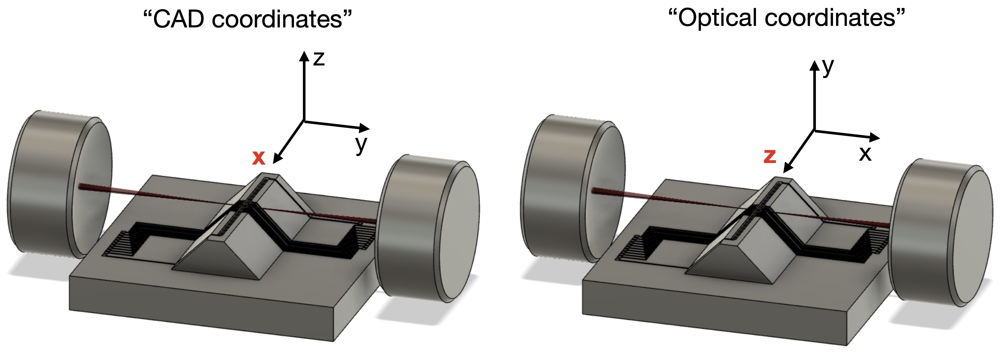

# BEM Simulations for QuantNET

For my simulations of the QuantNET trap, I created a fork of [haeffnerlab/bem](https://github.com/haeffnerlab/bem) called BEM-Savio. This is intended to be a leaner and better documented version of the BEM with further support for running BEM on Berkeley's high performance computing cluster (BRC-HPC) called Savio. 

## Table of contents
- [What is BRC-HPC Savio?](#id-1)
- [Savio Basics](#id-2)
- [bem-savio Workflow Overview](#id-3)
- [0. Installing bem-savio](#id-4)
- [1. Creating the Fusion360 Model](#id-5)
- [2. Configuring a new Job in bem-savio](#id-6)
- [3. BEM Electrostatics](#id-7)
- [4. Multipoles, Analysis, and Control](#id-8)
- [TODOs](#id-9)

## What is BRC-HPC Savio?<div id='id-1'/>

Explain here

## Savio Basics <div id='id-2'/>

The full user-guide for Savio may be found [here](https://docs-research-it.berkeley.edu/services/high-performance-computing/user-guide/).

Note: if this is the first time you are reading this documentation, I suggest skipping the remainder of this section and returning when you are ready to run BEM on savio and wish to learn the specifics.

### Service Units

Our lab is granted 300,000 yearly service units via Hartmut's faculty allowance. To check that you have access to this computing allowance, login to [MyBRC](https://mybrc.brc.berkeley.edu/user/login) and check that the BRC Cluster Project ```fc_haeffnerbem``` appears on your dashboard. To be added to the project, please contact Hartmut or Yi.

### Access to the Group Computing Allowance

### SSH

To ssh into the a login node, 

```ssh your_BRC_username@hpc.brc.berkeley.edu```

*The password is not your BRC pin*. One-time password authentication via your phone is required. If you have not already, set up OTP via Google Authenticator by following these [directions](https://docs-research-it.berkeley.edu/services/high-performance-computing/user-guide/setting-otp/). The password you must enter is ```XY``` where ```X``` is your BRC pin and immediately following with no spaces is ```Y``` the 6-digit one-time code from Authenticator. 

## Workflow Overview <div id='id-3'/>

Each time you run a BEM analysis, the workflow will consist broadly of four distinct tasks:

1. Creating the Fusion360 model
	- Creating a model of the trap in Fusion360
	- Coloring the trap electrodes in Fusion360
	- Exporting the model as an STL
2. Configuring a new job in bem-savio
	- Importing the STL model into bem-savio and re-meshing via bem-savio
	- Configuring simulation parameters in bem-savio
3. BEM electrostatics
	- Running the BEM electrostatics simulation to determine the potentials generated by each electrode.
	- The BEM electrostatics can either be run locally (i.e. on your computer) or on a Savio compute node (e.g. savio-bigmem with 20 cores and 500 Gb memeory). 
4. Multipoles and analysis
	- Visualizing the potentials generated by each electrode. For example, using the RF Psuedopotential to determine the location of the RF null.
	- Calculating the multiples of the potentials generated by each electrode.
	- Calculating the voltages that should be applied to each electrode in order to generate the desired trapping/control multipoles.
	
## 0. Installing bem-savio <div id='id-4'/>

### Installing BEM Locally

Note: as of writing, the current version of bem and bem-savio should run without error on Windows---though it has not been tested extensively. I recommend using Linux or a Unix-based system.

To install BEM on your computer, clone the [bem-savio](https://github.com/HaeffnerLab/bem-savio) directory and create a new conda environment. 

```conda create -n bem39 python=3.9  ```

Activate the environment. You should see the command prompt change to reflect this (e.g. from base to bem39)

```conda activate bem39```

Navigate to the bem-savio directory which contains ```setup.py``` and install BEM


```pip install .```

To optionally install Mayavi (for 3D visualization). Note: it is discouraged that you use Mayavi locally or on Savio. As of writing, Mayavi does not work on Savio. If Mayavi is not installed, you may see a warning that tvtk is not found when executing bem-savio. 

```pip install 'vtk<9.1' 'PyQt5<5.16' ; pip install 'mayavi<4.8' ```

To deactivate the environment,

```conda deactivate ``` 

### Installing BEM on Savio


The ```bem39``` conda environment and the bem-savio repository should already be be installed in the shared group directory ```/global/home/groups/fc_haeffnerbem/bem39```. To check, navigate to the group directory and run,

```
module load python
conda env list
```

If BEM is already installed in the group directory, skip this section. If bem-savio is not installed, navigate to the group directory, clone the [bem-savio](https://github.com/HaeffnerLab/bem-savio) directory and create a new conda environment. 

```
cd /global/home/groups/fc_haeffnerbem
conda create -p bem39 python=3.9  
```

Activate the environment. You should see the command prompt change to reflect this (e.g. from base to bem39)

```source activate /global/home/groups/fc_haeffnerbem/bem39```

Navigate to the bem-savio directory which contains ```setup.py``` and install BEM


```pip install .```

To optionally install Mayavi (for 3D visualization). Note: it is discouraged that you use Mayavi locally or on Savio. As of writing, Mayavi does not work on Savio. If Mayavi is not installed, you may see a warning that tvtk is not found when executing bem-savio. 

```pip install 'vtk<9.1' 'PyQt5<5.16' ; pip install 'mayavi<4.8' ```

To deactivate the environment,

```source deactivate ``` 

## 1. Creating the Fusion360 Model <div id='id-5'/>

### Coordinates

First, create a model of the trap in Fusion360. Check that you are working in CAD coordinates (see figure below). In other words, the trap axis in Fusion360 should be along the x-axis and the vertical direction should be along the z-axis.


<center><figcaption>During different stages of running bem-savio, two different conventions for coordinates are used. In CAD coordinates, x is along the trap axis and in optical coordinates z is along the trap axis.</figcaption></center>

Additionally, ensure that your trap model is a single body in Fusion360. When exporting, each body becomes its own STL and we wish to have the trap as a single STL.

### Coloring Electrodes

In the Fusion360 design, the trap is a single body. Therefore, we must be able to distinguish electrode surfaces from one another somehow. This is accomplished by coloring the face of each electrode. Later in bem-savio, we will identify the electrodes with a mapping between the color used in Fusion360 and the electrode name.

To facilitate this process, a set of predefined colors for BEM have been created. To import these colors into Fusion360:

1. In the Modify tab, click on Manage Materials to launch the Material Browser
2. In the Materials Browser, select Appearence on the top bar
3. In the bottom bar of the Material Browser, click on the folder icon, select Open Existing Library and load the BEM color library located ```RUN/helper_functions/bemColors_lib/bemColors.adsklib```
4. Now, you should see a bemCol folder appear in the left menu. For *each* color, right click and select Add To/Faviorites


Now color each electrode:

1. Select the face you wish to color
2. Open the Appearance tab (press 'a')
3. Using the search bar, find the appropriate BEM color you wish to use (```bemxx```) and drag that color over the face you wish to color.


<center><figcaption>Sample colored model. Notice bem1 is the top left electrode.</figcaption></center>


Note: make sure to color all surfaces that you wish to be included in the simulation. All surfaces that are not colored (and subsequently renamed in bem-savio) will be discarded by bem-savio.

Note: why are we specifically using these colors? STL files do not support colors. A (not-so-standardly) accepted workaround is to use the Attribute data of each triangle face to store color information. However, the Attribute is only 2 bytes long while a RGB color is 3 bytes long. Therefore, in general, the original colors will be modified when being saved to a STL. ```bemCol``` handles these color issues by defining a between the ```bemxx``` colors imported into Fusion360 and the colors bem-savio reads when importing the trap STL.  

### Exporting to STL

Finally, export your model as an STL. In Fusion360, select the trap body using the menu on the left-hand side and select Save as Mesh. Make sure to select the following options:

- Format: binary STL
- Units: mm

Optionally, you can refine the mesh density when exporting in Fusion360. However, we will be re-meshing in later steps, so this is not strictly necessary.

## 2. Configuring a new Job in bem-savio <div id='id-6'/>

### A New Job

In bem-savio, ```RUN/run.py``` is a provided script that handles initializing and running the simulation. *You will not need to edit* ```RUN/run.py```. Instead, for each new job (i.e. new trap) create a new directory in the jobs folder (e.g. ```RUN/jobs/your-job-name```) and place within the directory the STL model and a configuration file which informs ```RUN/run.py``` of the specific parameters of your simulation.

Navigate to ```RUN``` and create a new directory for your job in ```RUN/jobs```,

```
mkdir jobs/your-job-name
cd jobs/your-job-name
```

Place your STL in this new directory (i.e. ```RUN/jobs/your-job-name```) and create a configuration file,

```touch JOB_CONFIG.py```

Your directory tree should now look like this, 

```
\RUN
	run.py
	\jobs
		\example
			\...
		\your-job-name
			\your-model.stl
			\JOB_CONFIG.py
	\helper_functions
	\saviojob.sh
```

In the sections below, we will explain how to fill out ```JOB_CONFIG.py``` using the ```RUN/jobs/examples``` job as an example. It is important to populate the configuration file in the order of the sections below. 

### JOB_CONFIG: Importing STL

First, populate ```JOB_CONFIG.py``` with,

```python
from bem import *
import numpy as np

# name of the stl file
STL_file = 'your-model.stl'
# units of the mesh (e.g. 1e-3 for mm)
mesh_units = 1e-3

# plotting settings
show_plots = True
save_plots = True
save_plots_dpi = 1000
```

- ```STL_file```: the name of the STL model located in your job directory. For example, ```STL_file = 'pyramidtrap.stl'```.
- ```mesh_units``` are the units in which the STL file were exported.
- `show_plots`, `save_plots`, and `save_plots_dpi`: toggles whether plots of the mesh before and after re-meshing should be shown/saved.

### JOB_CONFIG: Naming Electrodes

Next, we name each electrode using the BEM colors described above. ```electrode_colors``` is a set tuples describing this mapping `('bemxx', electrode_name)`. The electrode names should be of the form `'DC* | RF* | GND'`. 

```
# naming electrodes
electrode_colors = {
    ('bem1', 'DC1'),
    ('bem2', 'DC2'),
    ('bem3', 'DC3'),
    ('bem4', 'DC4'),
    ('bem5', 'DC5'),
    ...
    ('bem21', 'DC21'),
    ('bem22', 'RF'),
    ('bem23', 'GND'),
}
```

### JOB_CONFIG: Specifying the Grid

The grid describes to bem-savio the set of points at which it should evaluate the potential generated by each electrode. Therefore, a finer the grid yields greater resolution for our potential.


<center><figcaption>A mockup of what a grid might look like. Note: in practice, the grid the you use should probably be finer and over a smaller area. However, this is easier to illustrate.</figcaption></center>

In order to configure the grid, we must specify,

- `x0,y0,z0` which is the location of the center (or origin) of our grid. The value of this point should be your best guess for the location of RF null.
- `Lx,Ly,Lz` is the size of each dimension of the grid. For example, if `Lx=0.100`, then the grid extends 50 microns to the left and 50 microns to right of the origin along the x-axis.

```
# specify grid origin
x0 = 0*1e-3
y0 = 0*1e-3
z0 = 2 + 75*1e-3

# specify grid points
Lx, Ly, Lz = 0.500, 0.100, 0.200 
s = 0.0025
sx, sy, sz = s, s, s
```

In the example above, we define the origin as at the center of the xy-plane and at a height of 2000+75 microns because the raise trap surface is 2 mm tall and we expect our trapping height to be 75 microns. Furthermore, we define the set of grid points over a volume of 500 x 100 x 200 microns with points every 2.5 microns in all directions (recall ```mesh_units=1e-3```).

### Compile Test!

If you've followed all the steps above, `JOB_CONFIG.py` now contains enough information to perform a basic test of: importing the STL, identifying the electrodes, and constructing the grid.

Navigate to the `RUN` folder. Activate the conda environment (`conda activate bem39`) if you have not already and execute,

```
python run.py [your-job-name]
```

`run.py` should run without error. If `show_plots` is toggled on, you should see a plot of trap mesh.

### JOB_CONFIG: Re-meshing

There are three main re-meshing operations:

1. Increasing density:
2. Increasing density with areas from constraints: 
3. Improving triangle quality: 

## 3. BEM Electrostatics <div id='id-7'/>

Explain what BEM is actually doing placing charges

### run.py Flags

The full behavior of `run.py`:

`python run.py [job-name] -r -s -n=[cores]`

- **`[job=name]`: required argument.** Name of your job directory in `RUN/jobs/`.
- `-r`: run BEM electrostatics after setup. The default behavior of this script completes all setup steps (read STl, name electrodes, re-mesh, generate grid), but exits without running electrostatics.
- `-s`: Savio mode. Sets -r, use_multiprocessing=True, and show_plots=false
- `-n`: when multiprocessing, this flag specifies the number of cores that should be used. By default, all cores are used. However, if your simulation is bottlenecked by memory, this command can be used to specify fewer multiprocesses.

### Running Locally

### Running on Savio

## 4. Multipoles, Analysis, and Control <div id='id-8'/>

### Plotting Potentials

### Calculating Multipoles

### Calculating Control Voltages


## TODOs <div id='id-9'/>
- wenhao get more colors?


## END END


## V. Running BEM on Savio

To find which accounts and partitions (within those accounts) that you have access to,

```sacctmgr -p show associations user=$USER```


The hardware configurations for each of the Savio partitions may be found [here](https://docs-research-it.berkeley.edu/services/high-performance-computing/user-guide/hardware-config/#Savio-Hardware).

The ```sq``` module shows recent and pending jobs,

```
module load sq
sq
```


Note: the directory where you run the ```sbatch``` command is the directory where you batch script runs.

Note: you have to deactivate the enviornment before running the sbatch command

sacct -j 12572927 --format=JobID,JobName,MaxRSS,Elapsed


